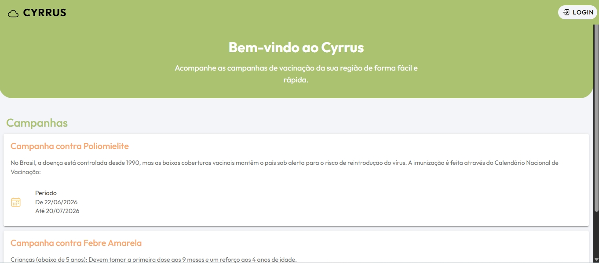
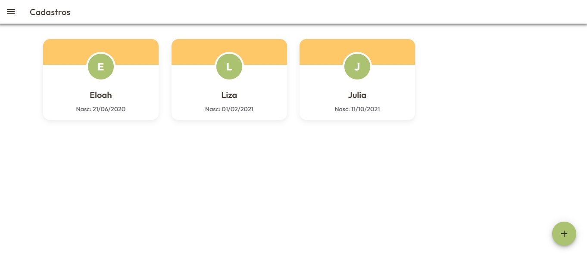
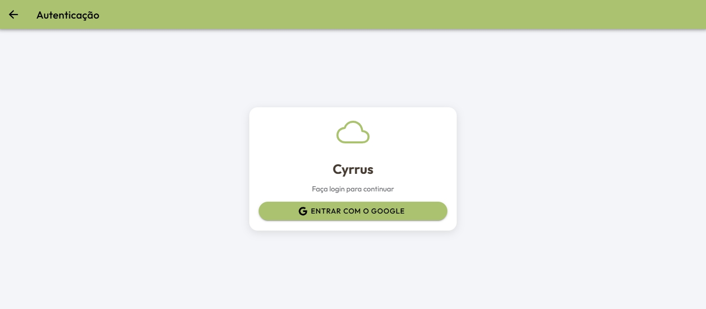
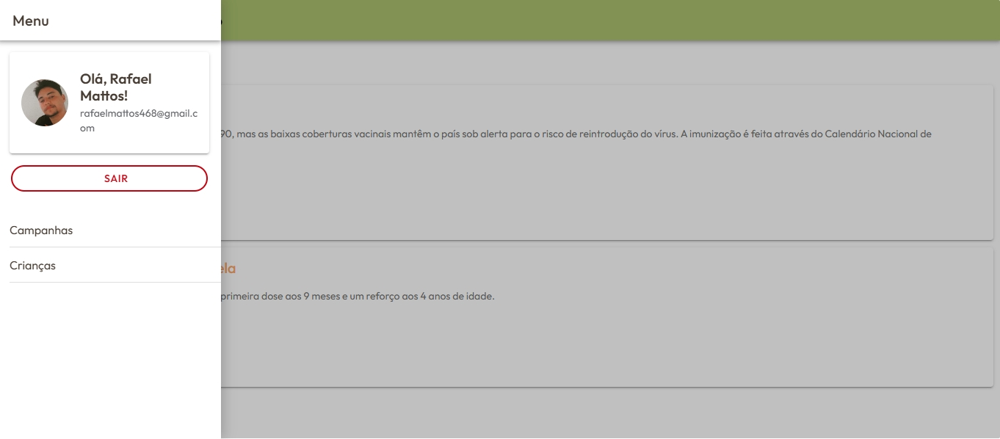
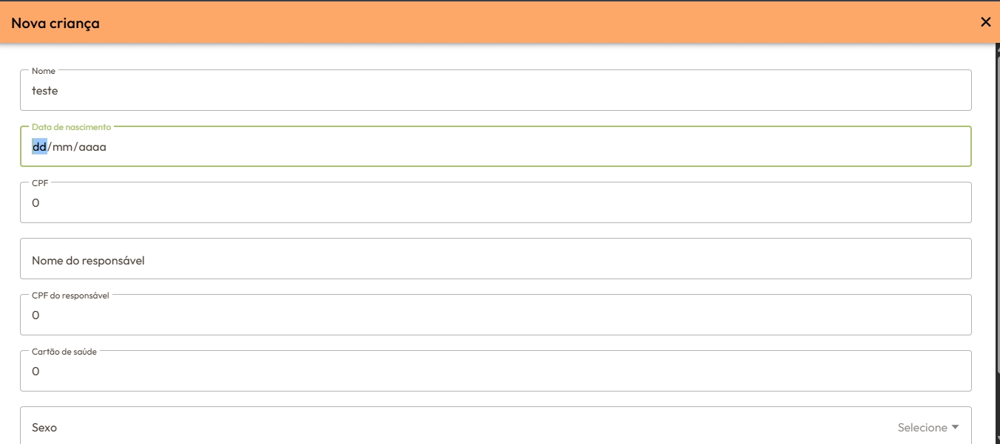
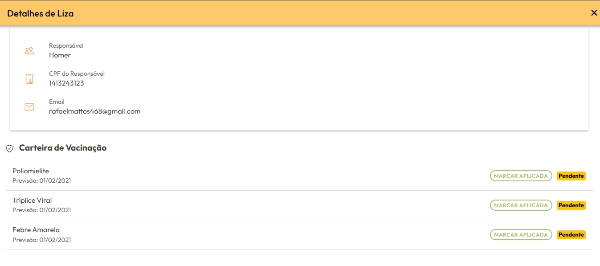

# Cyrrus

Aplicativo Ionic + Angular de acompanhamento de campanhas de vacinação e cadastro de crianças.

## Visão Geral

O `Cyrrus` é um app móvel híbrido desenvolvido com Ionic 8, Angular 20 e Capacitor 8. Ele integra Firebase Authentication e Firestore para permitir login via Google, exibir campanhas de vacinação e cadastrar crianças associadas ao usuário autenticado.

## Funcionalidades principais

- Página inicial pública com apresentação do app e acesso ao login.
- Autenticação com Google via Firebase Authentication.
- Área protegida para usuários autenticados:
  - Tela de campanhas de vacinação (`/home-users`).
  - Tela de gerenciamento de crianças (`/children`).
- Cadastro de crianças com dados pessoais e informações do responsável.
- Exibição de carteira de vacinação de cada criança em modal.
- Criação automática de registros de vacinação para cada criança a partir da coleção mestre `vacinas`.
- Menu lateral com acesso rápido a campanhas e crianças.

## Estrutura do projeto

- `src/app/app.routes.ts` - Rotas da aplicação e proteção de páginas com guards.
- `src/app/app.component.html` - Layout principal com menu lateral e área de conteúdo.
- `src/app/service/auth.ts` - Serviço de autenticação com Firebase Auth.
- `src/app/service/auth.guard.ts` - Guards `authGuard` e `guestGuard` para rotas.
- `src/app/service/database.ts` - Serviço de Firestore para crianças, vacinas e campanhas.
- `src/app/components/dados-user/` - Exibe dados do usuário e botão de logout/login.
- `src/app/components/login/` - Botão de login com Google.
- `src/app/components/children/` - Lista de crianças e visualização de detalhes/vacinação.
- `src/app/components/cadastro-children/` - Formulário para cadastrar novas crianças.
- `src/app/components/campanhas/` - Lista de campanhas de vacinação.
- `src/app/home/` - Tela inicial pública.
- `src/app/pages/` - Páginas principais da aplicação.

## Dependências principais

- Angular 20
- Ionic 8
- Firebase 12
- Capacitor 8
- RxJS
- TypeScript

## Pré-requisitos

- Node.js (recomendado 18 ou 20)
- npm
- Firebase project configurado com Authentication e Firestore
- Android SDK para build Android (opcional)

## Configuração do Firebase

A aplicação espera encontrar a configuração do Firebase em um arquivo de ambiente. Crie o arquivo `src/environments/environment.ts` com um conteúdo semelhante a este:

```ts
export const environment = {
  production: false,
  firebaseConfig: {
    apiKey: '<SEU_API_KEY>',
    authDomain: '<SEU_AUTH_DOMAIN>',
    projectId: '<SEU_PROJECT_ID>',
    storageBucket: '<SEU_STORAGE_BUCKET>',
    messagingSenderId: '<SEU_MESSAGING_SENDER_ID>',
    appId: '<SEU_APP_ID>'
  }
};
```

> Não faça commit de chaves ou credenciais sensíveis.

### Requisitos do Firebase

- Ative `Authentication -> Sign-in method -> Google`.
- Crie coleção `children` no Firestore.
- Crie coleção `campanha` no Firestore.
- Crie coleção `vacinas` usada como catálogo mestre ao cadastrar crianças.

## Instalação

No diretório do projeto:

```bash
npm install
```

## Executando em desenvolvimento

```bash
npm start
```

Isso inicia o Angular/Ionic no modo de desenvolvimento.

## Build

```bash
npm run build
```

## Testes

```bash
npm test
```

## Lint

```bash
npm run lint
```

## Rodando no Android

Se quiser gerar o app Android via Capacitor:

```bash
npm run build
npx cap sync android
npx cap open android
```

## Navegação e fluxo do app

- `/` -> redireciona para `/home`.
- `/home` -> página pública com campanhas e botão de login.
- `/auth` -> login com Google.
- `/home-users` -> área de campanhas protegida por autenticação.
- `/children` -> gerenciamento de crianças protegido por autenticação.

## Observações importantes

- O login do usuário é feito via `AuthService.loginWithGoogle()`.
- O `DatabaseService.addChild()` salva uma nova criança em `children` e cria registros de vacinação na subcoleção `children/{id}/registro_vacinacao` usando os dados da coleção `vacinas`.
- A página de crianças abre um modal com detalhes completos e vacinas ativas.

## Como contribuir

1. Faça um fork do repositório.
2. Crie uma branch com sua feature: `git checkout -b feature/nome-da-feature`.
3. Faça commit das alterações.
4. Envie um pull request.

## link em produção
Para acessar as funcionalidade da aplicação, é necessario se autenticar com uma conta google. 
[app](https://cyrrus-ef0a5.web.app/home)


## Imagens

- 
- 
- 
- 
- 
- 

